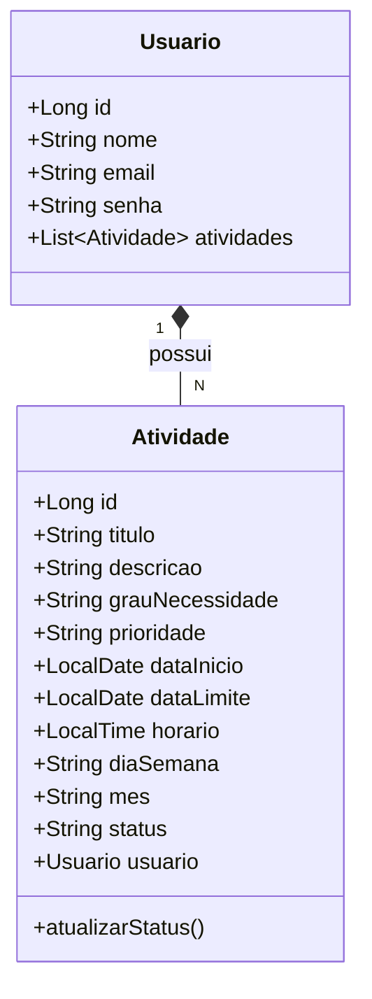

# Gerenciador de Tarefas
Java RESTful API criada para exercitar meus conhecimentos

## Diagrama de Classes

```mermaid
classDiagram
    class Usuario {
        +Long id
        +String nome
        +String email
        +String senha
        +List~Atividade~ atividades
    }
    
    class Atividade {
        +Long id
        +String titulo
        +String descricao
        +String grauNecessidade
        +String prioridade
        +LocalDate dataInicio
        +LocalDate dataLimite
        +LocalTime horario
        +String diaSemana
        +String mes
        +String status
        +Usuario usuario
        +atualizarStatus()
    }

    Usuario "1" *-- "N" Atividade : possui
```
